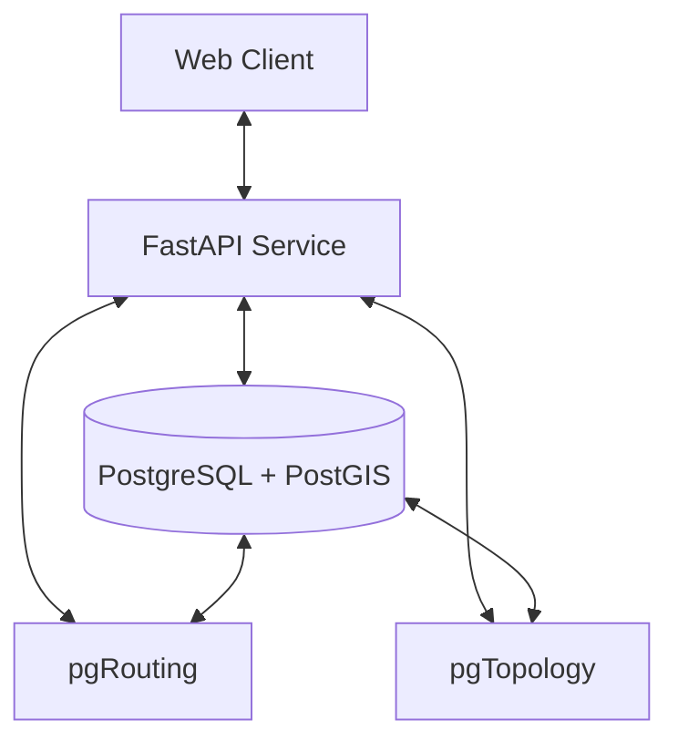

# System Architecture

This document provides an overview of the OpenGrid system architecture.

## High-Level Architecture

## Components

### 1. Web Client

- **Technology Stack**:
  - React
  - TypeScript
  - MapLibre GL JS
  - OpenLayers
  - Redux (state management)
  - Tailwind CSS (styling)

- **Key Features**:
  - Interactive map interface
  - Network visualization
  - Route planning
  - Data editing tools
  - Responsive design

### 2. Backend Service

- **Technology Stack**:
  - FastAPI (Python)
  - SQLAlchemy (ORM)
  - Alembic (migrations)
  - Uvicorn (ASGI server)
  - Pydantic (data validation)

- **Key Features**:
  - RESTful API
  - Authentication & Authorization
  - Data validation
  - Error handling
  - Request/Response logging

### 3. Database

- **Technology Stack**:
  - PostgreSQL 12+
  - PostGIS 3.0+
  - pgRouting
  - pgTopology
  - pgVersion

- **Key Features**:
  - Spatial data storage
  - Routing functionality
  - Topology support
  - Versioning
  - Full-text search

## Data Flow

1. **Client-Server Communication**:
   - RESTful API over HTTP/HTTPS
   - JSON for data exchange
   - JWT for authentication

2. **Data Processing**:
   - Client sends requests to the FastAPI service
   - Service validates and processes requests
   - Database queries are executed
   - Results are formatted and returned to the client

3. **Spatial Operations**:
   - Spatial queries are handled by PostGIS
   - Routing operations use pgRouting
   - Topological operations use pgTopology

## Security Considerations

1. **Authentication**:
   - JWT-based authentication
   - Password hashing with bcrypt
   - Token expiration and refresh

2. **Authorization**:
   - Role-based access control (RBAC)
   - Permission checks on API endpoints
   - Row-level security (RLS) in PostgreSQL

3. **Data Protection**:
   - Input validation
   - SQL injection prevention
   - CORS configuration
   - Rate limiting

## Scalability

1. **Horizontal Scaling**:
   - Stateless API services
   - Database connection pooling
   - Caching layer (Redis/Memcached)

2. **Performance Optimization**:
   - Database indexing
   - Query optimization
   - Pagination
   - Response compression

3. **Load Balancing**:
   - Multiple API instances
   - Database read replicas
   - CDN for static assets

## Deployment

### Development

- Local Docker Compose setup
- Hot-reloading for development
- Development database with sample data

### Production

- Containerized deployment with Docker
- Orchestration with Kubernetes
- Managed database service
- CI/CD pipeline

## Monitoring and Logging

1. **Application Logs**:
   - Structured logging (JSON)
   - Log levels (DEBUG, INFO, WARNING, ERROR)
   - Request/response logging

2. **Performance Metrics**:
   - Response times
   - Error rates
   - Database query performance

3. **Alerting**:
   - Error notifications
   - Performance degradation alerts
   - Resource utilization alerts

## Future Enhancements

1. **Real-time Updates**:
   - WebSocket support
   - Live data streaming
   - Collaborative editing

2. **Advanced Analytics**:
   - Network analysis
   - Traffic simulation
   - Predictive modeling

3. **Integration**:
   - GIS data import/export
   - Third-party API integration
   - Plugin system

## Dependencies

### Backend Dependencies

- FastAPI
- SQLAlchemy
- Alembic
- psycopg2
- python-jose
- python-multipart
- uvicorn

### Frontend Dependencies

- React
- TypeScript
- MapLibre GL JS
- OpenLayers
- Redux
- Axios
- Tailwind CSS

### Development Dependencies

- pytest
- black
- isort
- mypy
- eslint
- prettier

## License

[Your License Here]
